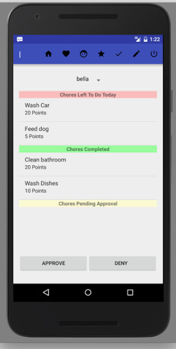

# Android 

##Overview
This is the Android app for our Chalkboard Chores group project. Chalkboard Chores is an application
where parent can easily create and track chores for their children.  Their children have a simple
interface to view chores and create wishlists.  They are able to exchange points that
they earn from completing chores for rewards that their parents make available.

## Resources
* [Butterknife library](http://jakewharton.github.io/butterknife/)
* [Retrofit library](http://square.github.io/retrofit/)